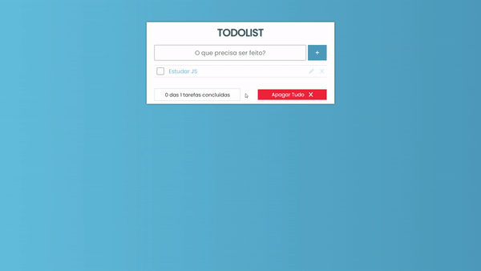

<h1 align="center">
  Todo List App 📝
</h1>

<div align="center">
   <a href="https://github.com/JohnPetros">
      
   </a>
   
   <a href="https://github.com/JohnPetros/rocketblog/commits/main">
      
   </a>
  </a>
   </a>
   <a href="https://github.com/JohnPetros/rocketblog/blob/main/LICENSE.md">
      
   </a>
    
</div>

## 💻 Projeto

Projeto web de um to do list, que é uma aplicação que permite adicionar tarefas do dia a dia com o objetivo de organizar melhor o cotidiano do usuário. Esse projeto foi desenvolvido com intuito de praticar a manipulação do DOM com JavaScript

### Demonstração
<div align="center">
    
</div>
---
<br>

## ✨ Funcionalidades
[x] Adicionar tarefa
[x] Checkar tarefa
[x] Editar tarefa
[x] Excluir todas ou uma tarefa específica
[x] Exibir progresso da realização das tarefas adicionadas em forma de porcentagem e barra de progresso
[x] Armazenar tarefas no local Storage do navegador
---
<br>

## 📖 Aprendizado
- Validação de formulário com HTML e JS
- Criação de elementos HTML com JS
- Manipulação de CSS com JS
- Novas formas de selecionar elementos com CSS
- Novas maneiras de estilizar elementos HTML com CSS
- Formas de trabalhar com eventos de teclado, clique e input com JS
- Manipulação do Local Storage (armazenamento local) do navegador com JS
---
<br>

## 🛠️ Tecnologias
Esse projeto foi desenvolvido com as seguintes tecnologias

✔️ **[Javascript](https://developer.mozilla.org/pt-BR/docs/Web/CSS)**

✔️ **[CSS](https://developer.mozilla.org/pt-BR/docs/Web/CSS)**

✔️ **[HTML](https://developer.mozilla.org/pt-BR/docs/Web/HTML)**

---
<br>

## 🚀 Como rodar este projeto

### Pré-requesitos

Embora não seja obrigatório, para rodar a aplicação de uma forma mais prática, é bom ter o editor de código [VSCode](https://code.visualstudio.com/) junto com a extensão [Live Server](https://marketplace.visualstudio.com/items?itemName=ritwickdey.LiveServer), que pode ser instalada no marketplace do próprio VSCode. 

#### 📟 Rodando a aplicação

```bash

# Clone este repositório no terminal/cmd
$ git clone https://github.com/JohnPetros/rocketshoes.git

# Acesse a pasta do projeto
$ cd rocketshoes

# Abra a pasta no VSCode
$ code .

# Execute o arquivo index com a extensão Live Server, clicando com o botão direito sobre ele e depois em Open with Live Server

```

---
<br>

## ⚙️ Deploy

O deploy desse projeto foi realizado através do **[Github Pages](https://pages.github.com/)**. Isso implica que você pode acessar o projeto funcionando acessando esse **[link](johnpetros.github.io/todo-list/)**

---
<br>

## :memo: Licença

Esse projeto está sob a licença MIT. Veja o arquivo [LICENSE](LICENSE) para mais detalhes.

---

Feito com 💜 by John Petros 👋🏻
